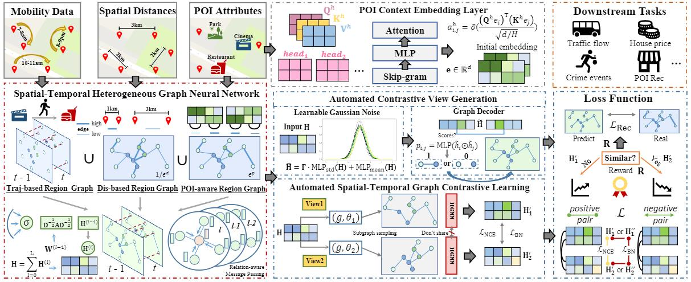
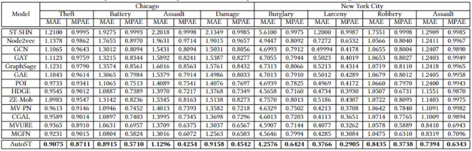

# Automated Spatio-Temporal Graph Contrastive Learning #
This is the implementation of Automated Spatio-Temporal Graph Contrastive Learning (AutoST):

## Requirements ##
Python = 3.7.13, pytorch = 1.12.0 with cuda = 10.2  and Tensorflow = 1.15.3 (crime prediction task (ST-SHN))

## Data ##
Moblity data, crime data, census block data, POI data, house price of Chicago ([https://data.cityofchicago.org/](https://data.cityofchicago.org/)) and New York([https://opendata.cityofnewyork.us/](https://opendata.cityofnewyork.us/)).
Also, we provide the process data and processing code for data preprocessing.

## Data Preocessing ##
    pre_s1.py # collecing positions of 180 (234) regions in Manhatton (a certain district) in New York (Chicago).
    pre_s2.py # collecting traffic data
    pre_s3.py # preprocessing the traffic data on correspongding regions
    pre_s4.py # preprocessing the POI data and obtain POI-aware Region Graph
    pre_poi_transformer.py # obatining the features of nodes by Transformer and Skip-gram
    pre_spatial_graph.py # constructing the trajectory-based Regoin Graph and Distance-based Region Graph
    pre_s5.py # constructing a hierarical graph
    pre_s6_dataloader.py # obtaining the dataloder (dataset.pt file) for next step to get region embeddings

## Hyperparameters ##
The dimensionality d of region representation is set as 96 . The depth of convolutional layers in GCN is set as 3. The learning rate is initialized as 0.0005 with the weight decay of 0.01. For the crime prediction backbone model, ST-SHN is configured with the learning rate of 0.001 and the weight decay of 0.96. The depth of the spatial path aggregation layers is set as 2. For the traffic prediction backbone model ST-GCN, the historical time window of all tests are set as 60 minutes with 12 observed data points that are utilized to forecast traffic conditions in the next 15, 30, 45 minutes. The baselines are implemented with the source code released by their original papers.

## Obtaining region representations ##
    cd data_augmentation
    loader.py # adding the dataset.py file for training the model of the region representations
    data_pre_4aug_fea.py   # training for obatining region representations

## Crime prediction task ##
The code of the ST-SHN is [https://github.com/akaxlh/ST-SHN](https://github.com/akaxlh/ST-SHN)

Replace the area embedding with the region represenation vetcor and run `HG_ST_labcode.py`.

Results of Crime Prediction task

## Traffic prediction task ##
The code of the ST-GCN is [https://github.com/VeritasYin/STGCN_IJCAI-18](https://github.com/VeritasYin/STGCN_IJCAI-18)
ST-GCN predicts traffic in three stages, namely 15 minutes, 30 minutes, 45 minutes.
Run `main.py`.

Results of Traffic Prediction task

## House prediction task ##
We use Lasso Regression to perform house price evaluation task.

## Citing ##
If our paper benefits to your research, please cite our paper using the bitex below:

    @inproceedings{zhang2023autost,
      title={Automated Spatio-Temporal Graph Contrastive Learning},
      author={Zhang, Qianru and Huang, Chao and Xia, Lianghao and Wang, Zheng and Li, Zhonghang and Yiu, Siuming},
      booktitle={Proceedings of the Web Conference (WWW)},
      year={2023}
    }
